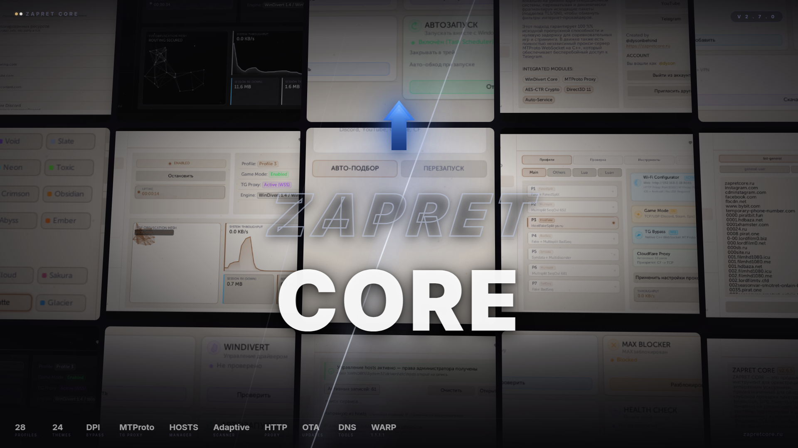

# гит временный до восстановления аккаунта основного
<br>

<p align="center">
  <picture>
    <source media="(prefers-color-scheme: dark)" srcset="https://img.shields.io/badge/%20-ZAPRET%20CORE-white?style=for-the-badge&labelColor=050508&color=050508">
    
  </picture>
</p>

<h1 align="center">
  С В О Б О Д А .
</h1>

<p align="center">
  <sub>
    Оркестрация трафика на низком уровне ядра. Полная анонимность.<br>
    <b>Никаких VPN.</b> Только твой личный канал и математически идеальная<br>
    фрагментация DPI&#8209;пакетов.
  </sub>
</p>

<br>

<p align="center">
  <a href="https://zapretcore.ru/downloads.html"></a>&nbsp;&nbsp;
  <a href="https://pressf.com/dys0n/donate"></a>&nbsp;&nbsp;
  <a href="https://t.me/wokeupinthemorning"></a>
</p>

<br>

<p align="center">
  
  
  
  
  
</p>

<br>

<p align="center">
  
</p>

<br>

---

<br>

<kbd>&nbsp;&nbsp;◆&nbsp; KERNEL LEVEL INJECTION &nbsp;◆&nbsp; DPI BYPASS PROTOCOL &nbsp;◆&nbsp; WINDIVERT ORCHESTRATION &nbsp;◆&nbsp; MTPROTO WEBSOCKET &nbsp;◆&nbsp; ZERO TELEMETRY &nbsp;◆&nbsp; PACKET FRAGMENTATION &nbsp;◆&nbsp;</kbd>

<br><br>

---

<br>

> **`ZAPRET CORE`** работает на уровне ядра Windows. Пакеты фрагментируются и модифицируются локально через WinDivert — трафик **никогда не покидает вашу машину**. Это не VPN. Нет удалённых серверов. Нет потери скорости. Нет логов. Нулевая задержка.

<br>

<table>
<tr>
<td>

&nbsp;&nbsp;**[`// 001`](#-архитектура)** Архитектура&nbsp;&nbsp;
</td>
<td>

&nbsp;&nbsp;**[`// 002`](#-direct--vpn)** Direct ≠ VPN&nbsp;&nbsp;
</td>
<td>

&nbsp;&nbsp;**[`// 003`](#-возможности)** Возможности&nbsp;&nbsp;
</td>
<td>

&nbsp;&nbsp;**[`// 004`](#-профили-обхода)** Профили&nbsp;&nbsp;
</td>
<td>

&nbsp;&nbsp;**[`// 005`](#-модули)** Модули&nbsp;&nbsp;
</td>
<td>

&nbsp;&nbsp;**[`// 006`](#-интерфейс)** Интерфейс&nbsp;&nbsp;
</td>
<td>

&nbsp;&nbsp;**[`// 007`](#-faq)** FAQ&nbsp;&nbsp;
</td>
</tr>
</table>

<br><br>

<!---------- SECTION 001 — ARCHITECTURE ---------->

## `// 001` Архитектура

<sub>PLATFORM MODULES</sub>

<br>

```
                        ╔══════════════════════════════════════════════════════════╗
                        ║                  Z A P R E T   C O R E                  ║
                        ║            C++20  ·  MSVC 2022  ·  Dear ImGui           ║
                        ╠══════════════════╦══════════════════╦════════════════════╣
                        ║    UI  LAYER     ║    NET  LAYER    ║    DPI  ENGINE     ║
                        ║                  ║                  ║                    ║
                        ║  Direct3D 11     ║  MTProto WS      ║  winws.exe         ║
                        ║  Dear ImGui      ║  CF Balancer     ║  winws2.exe        ║
                        ║  24 Themes       ║  HTTP Proxy      ║  WinDivert         ║
                        ║  Animations      ║  Wi-Fi Setup     ║  28 Profiles       ║
                        ║  Terminal        ║  DoH DNS         ║  Desync / Fake     ║
                        ║  Chat            ║  CF Worker       ║  SNI Spoof         ║
                        ╠══════════════════╩══════════════════╩════════════════════╣
                        ║                  S E R V I C E S                         ║
                        ║     Windows Service  ·  Autostart  ·  OTA  ·  Hosts Mgr  ║
                        ╠═════════════════════════════════════════════════════════ ╣
                        ║                WinDivert64.sys                           ║
                        ║             ( Kernel-level NDIS hook )                   ║
                        ╚═════════════════════════════════════════════════════════ ╝
```

<br>

<table>
<tr>
<td width="160"><b><code>Рендер</code></b></td>
<td>Direct3D 11 · аппаратное ускорение · Dear ImGui · 0% CPU в простое</td>
</tr>
<tr>
<td><b><code>Крипто</code></b></td>
<td>Windows CNG — BCrypt AES-CTR (MTProto handshake) · DPAPI</td>
</tr>
<tr>
<td><b><code>Сеть</code></b></td>
<td>WinHTTP WebSocket · raw TCP · Cloudflare CDN pool · DoH 1.1.1.1</td>
</tr>
<tr>
<td><b><code>DPI</code></b></td>
<td>WinDivert64.sys — перехват пакетов на уровне ядра NDIS</td>
</tr>
<tr>
<td><b><code>Конфиг</code></b></td>
<td>JSON (миграция с INI) · DPAPI для учётных данных</td>
</tr>
<tr>
<td><b><code>Сборка</code></b></td>
<td>Visual Studio 2022 · MSVC v145 · C++20 · Windows x64</td>
</tr>
</table>

<br><br>

---

<br>

<!---------- SECTION 002 — DIRECT ≠ VPN ---------->

## `// 002` Direct ≠ VPN

<sub>WHY LOCAL MODE</sub>

<br>

<table>
<tr>
<td width="50%" valign="top">

### &nbsp;&nbsp;🛡️&nbsp; ZAPRET CORE
<sub><code>// local engine</code></sub>

&nbsp;

**✓&nbsp; 100% пропускная способность.**
Трафик не уходит в чужой ЦОД — фрагментация и SNI-spoofing работают локально на уровне ядра.

**✓&nbsp; Нативный пинг.**
Игры, Discord-голосовые и стриминг идут напрямую — никаких overlay-задержек VPN-туннеля.

**✓&nbsp; Никакого аккаунта.**
Установил, запустил — работает. Никакой подписки, лимитов, телеметрии.

**✓&nbsp; HTTP-прокси для телефона.**
Один ПК раздаёт обход на все устройства Wi-Fi сети — без root, без VPN-приложений на смартфоне.

</td>
<td width="50%" valign="top">

### &nbsp;&nbsp;🌐&nbsp; VPN-провайдер
<sub><code>// classic vpn</code></sub>

&nbsp;

**✗&nbsp; Маршрут через чужой сервер.**
Скорость падает в 2–4 раза, пинг растёт на сотни мс, провайдер видит постоянный шифрованный туннель.

**✗&nbsp; Легко детектируется.**
ТСПУ распознаёт OpenVPN/WireGuard по сигнатурам и блокирует протокол целиком.

**✗&nbsp; Аккаунт и подписка.**
Доверие сторонней компании, риск утечек логов, ежемесячная плата.

**✗&nbsp; Каждое устройство отдельно.**
Свой клиент на каждый телефон, ПК и приставку — и платная подписка масштабируется по числу устройств.

</td>
</tr>
</table>

<br><br>

---

<br>

<!---------- SECTION 003 — FEATURES ---------->

## `// 003` Возможности

<sub>PLATFORM FEATURES</sub>

<br>

<table>
<tr>
<td width="50%" valign="top">

#### &nbsp; `ЯДРО`

| | |
|:--|:--|
| 🔹 | **28 профилей обхода DPI** — под каждого провайдера |
| 🔹 | **Kernel-level перехват** через WinDivert64.sys |
| 🔹 | **Нулевая задержка** — 100% скорости канала |
| 🔹 | **Hot-swap профилей** — переключение на лету |
| 🔹 | **Adaptive Scanner** — автоподбор профиля |
| 🔹 | **Windows Service** — фоновая работа, автозапуск |

</td>
<td width="50%" valign="top">

#### &nbsp; `СЕТЬ`

| | |
|:--|:--|
| 🔹 | **MTProto Proxy** — Telegram через WebSocket + CF CDN |
| 🔹 | **Cloudflare Worker** — резервный канал через Workers |
| 🔹 | **HTTP Proxy** — раздача обхода на телефон `:8080` |
| 🔹 | **Wi-Fi Setup** — веб-страница с QR-кодом `:8081` |
| 🔹 | **Hosts Manager** — обход L7-блокировок |
| 🔹 | **DoH DNS** — DNS-over-HTTPS через CF `1.1.1.1` |

</td>
</tr>
<tr>
<td width="50%" valign="top">

#### &nbsp; `ИНТЕРФЕЙС`

| | |
|:--|:--|
| 🔹 | **24 темы** — 12 тёмных + 12 светлых |
| 🔹 | **Color Picker** — настройка акцентного цвета |
| 🔹 | **Встроенный терминал** — cmd.exe в приложении |
| 🔹 | **Встроенный чат** — общение с сообществом |
| 🔹 | **Атмосферные эффекты** — Snow / Matrix / FCK RKN |
| 🔹 | **Hardware Accelerated** — DirectX 11, 0% CPU idle |

</td>
<td width="50%" valign="top">

#### &nbsp; `БЕЗОПАСНОСТЬ`

| | |
|:--|:--|
| 🔹 | **Подписанные бинарники** — signtool + сертификат |
| 🔹 | **xorstr обфускация** — строки зашифрованы compile-time |
| 🔹 | **Права администратора** — WinDivert требует elevation |
| 🔹 | **Локальная обработка** — никаких внешних серверов |
| 🔹 | **Аккаунт-система** — роли, аватары, профили |
| 🔹 | **DPAPI шифрование** — учётные данные защищены |

</td>
</tr>
</table>

<br><br>

---

<br>

<!---------- SECTION 004 — PROFILES ---------->

## `// 004` Профили обхода

<sub>28 DPI-DESYNC STRATEGIES</sub>

<br>

> 28 предустановленных стратегий, каждая под конкретные условия. **Hot-swap** — кликните на другой профиль при работающем обходе, движок автоматически перезапустится.

<br>

<table>
<tr>
<td>

#### &nbsp; `УНИВЕРСАЛЬНЫЕ` <sub>— рекомендуются для начала</sub>

| Профиль | Стратегия | Лучше всего для |
|:--------|:----------|:----------------|
| **`P3`** | Fake + Split | YouTube, Discord, Telegram |
| **`P5`** | Multisplit + BadSeq | Twitch, YouTube, общий обход |
| **`P7`** | FakedSplit + TTL | Стабильный обход большинства провайдеров |

</td>
</tr>
<tr>
<td>

#### &nbsp; `ИГРОВЫЕ` <sub>— P10 – P14</sub>

| Профиль | Описание | Рекомендация |
|:--------|:---------|:-------------|
| **`P10`** | Apex / Multisplit AutoTTL | Apex Legends |
| **`P11`** | Fuck DPI / Multisplit + Syndata | Мультиигровой |
| **`P12`** | Real / Apex FakedSplit | **Лучший для Apex** |
| **`P13`** | General ALT 7.1 (расш. порты + STUN) | Общие игры |
| **`P14`** | General ALT 7.2 (расш. порты + STUN) | Общие игры |

</td>
</tr>
<tr>
<td>

#### &nbsp; `TWITCH`

| Профили | Статус | Примечание |
|:--------|:-------|:-----------|
| **`P3, P5, P6, P7, P9`** | Полный обход | Стрим + чат сразу |
| **`P1, P2, P8, P11, P12`** | Работает | Чат подключается с задержкой |
| **`P14`** | Частично | Работает после ожидания |

</td>
</tr>
</table>

<br>

> [!TIP]
> **Не знаете какой профиль?** Нажмите **`АВТО-ПОДБОР`** в адаптивном сканере — программа автоматически найдёт лучший профиль для вашего провайдера.

<br><br>

---

<br>

<!---------- SECTION 005 — MODULES ---------->

## `// 005` Модули

<sub>PLATFORM MODULES</sub>

<br>

<details open>
<summary><b><code>&nbsp; MTPROTO PROXY &nbsp;</code></b> — Telegram через WebSocket + Cloudflare CDN</summary>

<br>

Встроенный Telegram-прокси с автоматической маршрутизацией через Cloudflare.

| Параметр | Значение |
|:---------|:---------|
| **Порт** | `0.0.0.0:1080` — доступен для всех устройств в сети |
| **Протоколы** | MTProto abridged / intermediate / padded |
| **Шифрование** | AES-CTR через Windows CNG (BCrypt) |
| **Пул** | Предоткрытые WebSocket-соединения с age limits |
| **Ротация** | Cloudflare-домены обновляются каждые 60 мин |

```
Настройка в Telegram:
  Настройки → Данные и память → Прокси → Добавить прокси
  Тип: SOCKS5  ·  Сервер: 127.0.0.1  ·  Порт: 1080

  Или нажмите «Применить настройки прокси Telegram» в Settings
```

<br>
</details>

<details>
<summary><b><code>&nbsp; CLOUDFLARE PROXY & WORKER &nbsp;</code></b> — двухуровневый fallback</summary>

<br>

| Уровень | Описание |
|:--------|:---------|
| **CF Proxy** | Маршрутизация через пул Cloudflare-доменов |
| **CF Worker** | Резервный канал через ваш Cloudflare Worker |

**Цепочка приоритетов:**

```
cf_first ON:   CF Proxy  →  CF Worker  →  TCP
cf_first OFF:  CF Worker  →  TCP  →  CF Proxy
```

> Для настройки CF Worker укажите домен в Settings: `xxx.username.workers.dev`

<br>
</details>

<details>
<summary><b><code>&nbsp; HTTP PROXY &nbsp;</code></b> — раздача обхода на мобильные устройства</summary>

<br>

| Порт | Назначение |
|:-----|:-----------|
| **`:8080`** | HTTP Proxy для браузера и приложений |
| **`:8081`** | Веб-страница настройки с QR-кодом |

```
1. Включите HTTP Proxy в Settings
2. Откройте http://<IP вашего ПК>:8081 на телефоне
3. Отсканируйте QR-код — готово
```

> ПК и телефон должны быть в одной Wi-Fi сети.

<br>
</details>

<details>
<summary><b><code>&nbsp; ADAPTIVE SCANNER &nbsp;</code></b> — автоматический подбор профиля</summary>

<br>

```
1. Нажмите АВТО-ПОДБОР на Dashboard
2. Сканер проверит все профили через TCP RTT (time_connect)
3. Лучший профиль применится автоматически
4. Бейджи покажут все рабочие альтернативы
```

> Пинг измеряется реалистично — чистый TCP round-trip, без overhead запуска процесса.

<br>
</details>

<details>
<summary><b><code>&nbsp; HOSTS MANAGER &nbsp;</code></b> — обход L7-блокировок</summary>

<br>

Когда DPI-desync не помогает, потому что блок на стороне сервиса — HOSTS-подмена возвращает edge-IP без geo-блокировки.

| Категория | Сервисы |
|:----------|:--------|
| **Напрямую** | WhatsApp, Discord, YouTube, GitHub, x.com, Supercell |
| **ИИ** | ChatGPT, Claude, Gemini, Notion, DeepL |
| **Остальные** | Spotify, TikTok, Twitch, JetBrains, Adobe, Canva |

- Записи в маркированном блоке `# ZAPRET CORE HOSTS BEGIN ... END`
- «Очистить» удаляет только наш блок — ваши записи не трогаются
- Автоматический `ipconfig /flushdns` после каждого изменения

<br>
</details>

<details>
<summary><b><code>&nbsp; DNS TOOLS &nbsp;</code></b> — DoH + SNI Spoofing</summary>

<br>

- **DoH** — DNS-over-HTTPS через Cloudflare `1.1.1.1`
- **SNI Spoofing** — маскировка целевого домена
- DNS-серверы: `Zapret DNS` · `XBOX DNS` · `Comss DNS` · `Malware DNS`

<br>
</details>

<details>
<summary><b><code>&nbsp; ТЕРМИНАЛ &nbsp;</code></b> — встроенный cmd.exe</summary>

<br>

Полноценный терминал прямо во вкладке **LOGS**:

- Переключатель «Логи / Терминал» — один клик
- Поддержка кириллицы (UTF-8 + CP866)
- Команды пользователя подсвечены голубым
- Буфер на 2000 строк, авто-прокрутка
- Ленивый запуск — не потребляет ресурсы пока не откроете

<br>
</details>

<br><br>

---

<br>

<!---------- SECTION 006 — INTERFACE ---------->

## `// 006` Интерфейс

<sub>APPLICATION PREVIEW</sub>

<br>

<table>
<tr>
<td width="50%" valign="top">

#### &nbsp; `DARK THEMES` <sub>× 12</sub>

| | |
|:--|:--|
| ◼ Midnight | ◼ Void |
| ◼ Slate | ◼ Emerald |
| ◼ Neon | ◼ Toxic |
| ◼ Phantom | ◼ Crimson |
| ◼ Obsidian | ◼ Carbon |
| ◼ Abyss | ◼ Ember |

</td>
<td width="50%" valign="top">

#### &nbsp; `LIGHT THEMES` <sub>× 12</sub>

| | |
|:--|:--|
| ◻ Snow | ◻ Cloud |
| ◻ Sakura | ◻ Pearl |
| ◻ Latte | ◻ Glacier |
| ◻ Mint | ◻ Lavender |
| ◻ Cream | ◻ Rose |
| ◻ Frost | ◻ Ivory |

</td>
</tr>
</table>

<br>

- **Color Picker** — hue + saturation bars, hex chip, drag
- **Атмосферные эффекты** — Snow / Matrix / FCK RKN
- Все элементы адаптированы: трей, роли, логи, сетка, статистика, тултипы

<br>

### Быстрый старт

<table>
<tr>
<td width="160"><b><code>ОС</code></b></td>
<td>Windows 10 / 11 (x64)</td>
</tr>
<tr>
<td><b><code>Права</code></b></td>
<td>Администратор (для WinDivert)</td>
</tr>
<tr>
<td><b><code>GPU</code></b></td>
<td>Любой с поддержкой DirectX 11</td>
</tr>
<tr>
<td><b><code>RAM</code></b></td>
<td>~50 MB</td>
</tr>
<tr>
<td><b><code>Диск</code></b></td>
<td>~30 MB</td>
</tr>
</table>

<br>

```
 01   Скачайте последний релиз с zapretcore.ru или GitHub Releases
 02   Распакуйте в любую папку
 03   Запустите zapret core.exe от имени администратора
 04   Выберите профиль (P3, P5, P7 — универсальные) и нажмите «Запустить обход»
```

<br>

### Windows Service

```
Имя службы:  zapret
Активация:   Settings → Windows Service → Установить
```

- Обход работает без открытого окна
- Автозапуск через Task Scheduler (`RunLevel=HIGHEST`)
- Переключение профилей из трея

<br>

### OTA-обновления

- Автоматическая проверка новых версий
- Пользовательские списки (`*-user`) сохраняются
- Поддержка версий с суффиксами (`2.7.0a`, `2.7.0b`, `2.7.0c`)
- Одно нажатие — скачать и применить

<br><br>

---

<br>

<!---------- SECTION 007 — FAQ ---------->

## `// 007` FAQ

<sub>FREQUENTLY ASKED QUESTIONS</sub>

<br>

<details>
<summary>&nbsp;<b>Антивирус ругается на WinDivert — это нормально?</b></summary>

<br>

Да. **WinDivert** — легитимный open-source драйвер для перехвата сетевого трафика на уровне ядра. Антивирусы детектируют его как `RiskTool.Multi.WinDivert` — это штатное поведение для любого драйвера, работающего с сетевым стеком. Добавьте директорию программы в исключения.

<br>
</details>

<details>
<summary>&nbsp;<b>Какой профиль выбрать?</b></summary>

<br>

Начните с **P3**, **P5** или **P7** — они универсальные. Если не работает — запустите **Adaptive Scanner** (кнопка `АВТО-ПОДБОР`), он автоматически найдёт лучший профиль.

<br>
</details>

<details>
<summary>&nbsp;<b>Как раздать обход на телефон?</b></summary>

<br>

1. Включите HTTP Proxy в Settings
2. На телефоне откройте `http://<IP компьютера>:8081`
3. Следуйте инструкциям или отсканируйте QR-код

ПК и телефон должны быть в одной Wi-Fi сети.

<br>
</details>

<details>
<summary>&nbsp;<b>Зачем HOSTS если есть DPI-обход?</b></summary>

<br>

DPI-обход и HOSTS работают на разных уровнях. HOSTS подменяет DNS **до** отправки пакета, а DPI-desync модифицирует **уже отправленные** пакеты. Сервисы вроде ChatGPT, Spotify, Notion блокируют по IP на L7 — HOSTS-подмена возвращает edge-IP без geo-блокировки.

<br>
</details>

<details>
<summary>&nbsp;<b>Это VPN?</b></summary>

<br>

**Нет.** ZAPRET CORE не создаёт туннель, не маршрутизирует трафик через удалённые серверы и не снижает скорость. Весь процесс локальный — пакеты модифицируются на уровне ядра ОС. 100% пропускной способности канала.

<br>
</details>

<details>
<summary>&nbsp;<b>Права администратора обязательны?</b></summary>

<br>

Да. WinDivert и управление Windows Service требуют прав администратора. Без них обход работать не может.

<br>
</details>

<details>
<summary>&nbsp;<b>После обновления пропали настройки hosts</b></summary>

<br>

Пользовательские списки (`*-user`) сохраняются при OTA начиная с v2.7.0. Если вы обновляетесь с более ранней версии — сохраните настройки вручную.

<br>
</details>

<details>
<summary>&nbsp;<b>Twitch не работает</b></summary>

<br>

Попробуйте **P3**, **P5** или **P7**. Если чат не загружается сразу — подождите несколько секунд, на некоторых профилях он подключается с задержкой. Убедитесь что WARP выключен.

<br>
</details>

<br><br>

---

<br>

<!---------- SECURITY ---------->

> [!CAUTION]
> **Единственные официальные источники:**
>
> | Ресурс | Ссылка |
> |:-------|:-------|
> | GitHub | **[zapretcore/zapret-core](https://github.com/dysonbehind/zapret-discord-youtube)** |
> | Сайт | **[zapretcore.ru](https://zapretcore.ru)** |
> | Telegram | **[@zapretcore](https://t.me/wokeupinthemorning)** |
>
> Всё остальное — **подделка**. Не скачивайте из других источников.

> [!IMPORTANT]
> **Все релизы подписаны** через `signtool` с верифицированным сертификатом. Если цифровая подпись не совпадает — файл скомпрометирован. Проверяйте: `ПКМ → Свойства → Цифровые подписи`.

> [!WARNING]
> **WinDivert** детектируется антивирусами как `RiskTool.Multi.WinDivert` — это штатное поведение для драйверов, работающих с сетевым стеком. Добавьте директорию программы в исключения.

> [!NOTE]
> **Исходный код не публикуется.** Распространяются только подписанные бинарники через [Releases](https://github.com/dysonbehind/zapret-discord-youtube/releases). Проект разрабатывается приватно.

<br><br>

---

<br>

<p align="center">
  <b>⭐ Star этого репозитория — самый простой способ поддержать!</b>
</p>

<br>

<p align="center">
  <a href="https://pressf.com/dys0n/donate"></a>
</p>

<p align="center">
  <code>USDT (TRC20): soon</code>&nbsp;&nbsp;·&nbsp;&nbsp;<code>BTC: soon</code>
</p>

<br>

---

<p align="center">
  <sub><b>ZAPRET CORE</b> &copy; 2026 DYSONBEHIND</sub>
</p>
<p align="center">
  <sub>
    <a href="https://zapretcore.ru">zapretcore.ru</a>&nbsp;&nbsp;·&nbsp;&nbsp;
    <a href="https://github.com/dysonbehind/zapret-discord-youtube">GitHub</a>&nbsp;&nbsp;·&nbsp;&nbsp;
    <a href="https://t.me/wokeupinthemorning">Telegram</a>&nbsp;&nbsp;·&nbsp;&nbsp;
    <a href="https://zapretcore.ru/donators.html">Меценаты</a>&nbsp;&nbsp;·&nbsp;&nbsp;
    <a href="https://zapretcore.ru/games.html">Игры</a>
  </sub>
</p>

<br>
